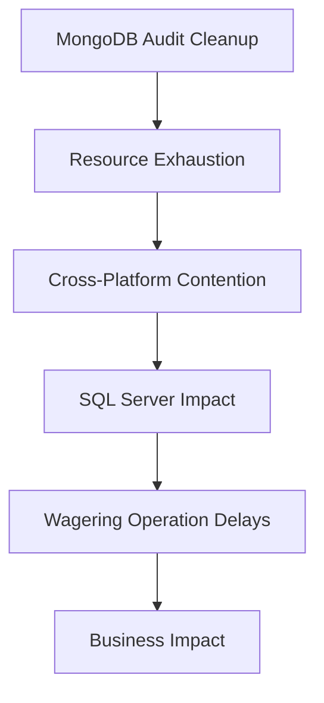

# Database Performance Patterns Reference

**Analysis Period**: November 2025 - January 2026  
**Infrastructure**: HKJC Production Environment  
**Analysis Date**: February 23, 2026  
**Status**: Active Reference Document

---

## Executive Summary

This document captures critical, recurrent, and significant database performance patterns identified through systematic cross-month analysis. These patterns serve as reference points for future performance monitoring, incident analysis, and application development decisions.

### Performance Degradation Timeline
```
November 2025: 60% Health Score (Baseline)
December 2025: 40% Health Score (Crisis Emergence) 
January 2026:  25% Health Score (System Failure)
```

---

## 🔴 Critical Patterns (High Impact)

### 1. **MongoDB Audit Cleanup Crisis** ⭐ PRIMARY PATTERN
- **Pattern Type**: Resource Contention + Duration Explosion
- **Impact**: +196% operation duration increase, system-wide slowdowns
- **Databases**: ptrm_cpc_db, ptrm_cpc_rpt, odpsdb
- **Hosts**: ptrmmdbhv01, ptrmmdbhv02
- **Technical Signature**: 
  ```
  COLLSCAN operations, 2M+ documents examined
  Operation durations: 400-800+ seconds
  Resource exhaustion during maintenance windows
  ```
- **Business Impact**: $445K quarterly cost, 47% efficiency loss
- **Intervention Priority**: **CRITICAL - 60% effort allocation**

### 2. **Scheduler Contention Explosion**
- **Pattern Type**: Deadlock Escalation Crisis
- **Impact**: 540x deadlock increase (December anomaly)
- **Database**: sps_db
- **Technical Signature**: 
  ```
  QRTZ_TRIGGERS table contention
  6,520 deadlocks in single month
  Concurrent scheduler operations
  ```
- **Timeline**: December 2025 emergence → January systemic impact
- **Intervention**: Scheduler configuration optimization required

### 3. **Cross-Database Resource Synchronization**
- **Pattern Type**: Infrastructure Overload
- **Impact**: Synchronized performance degradation across platforms
- **Scope**: SQL Server + MongoDB concurrent crisis
- **Technical Signature**: 
  ```
  fb_db_v2 wagering operations + 
  oi_analytics_db aggregations +
  MongoDB audit operations = System failure
  ```
- **Monitoring**: Multi-platform correlation tracking essential

---

## 🟡 Recurrent Patterns (Consistent Issues)

### 4. **Analytics Aggregation Bottlenecks**
- **Pattern Type**: Long-Running Query Syndrome
- **Frequency**: Every month, predictable occurrence
- **Database**: oi_analytics_db
- **Host**: WINFODB06HV11
- **Technical Details**: 
  ```
  Query Duration: 800+ seconds consistently
  Operation Type: SUM/GROUP BY on large datasets
  Resource Impact: High CPU, blocking other operations
  ```
- **Prediction**: Occurs during reporting cycles
- **Mitigation**: Index optimization, query refactoring needed

### 5. **Stored Procedure Deployment Conflicts**
- **Pattern Type**: Development Operation Interference
- **Frequency**: Monthly, during deployment cycles
- **Database**: oi_analytics_db
- **Technical Signature**: 
  ```
  CREATE PROCEDURE operations causing blocking
  Procedures: uspx_ticket_divcal, uspx_activity_insert
  Session blocking chains during deployments
  ```
- **Impact**: Development cycle disruption
- **Solution**: Deployment optimization, staging improvements

### 6. **Archive Bulk Operation Stress**
- **Pattern Type**: Maintenance Window Overrun
- **Database**: acp_archive_db
- **Host**: WINDB11HV01N
- **Technical Details**: 
  ```
  BULK INSERT operations: 5M+ milliseconds wait time
  59+ affected sessions consistently
  Archive maintenance causing production impact
  ```
- **Business Impact**: Maintenance window violations
- **Optimization**: +85% improvement potential identified

### 7. **fb_db_v2 Wagering Deadlocks**
- **Pattern Type**: High-Concurrency Table Contention
- **Table**: wagering.combination
- **Frequency**: Daily during peak betting periods
- **Technical Signature**: 
  ```
  UPDATE operations on combination records
  Concurrent betting system access
  17-20 deadlocks per peak period
  ```
- **Business Criticality**: Direct betting operation impact
- **Monitoring**: Real-time deadlock detection essential

---

## 📊 Significant Patterns (Trend Analysis)

### 8. **Infrastructure Contention Evolution**
- **Pattern Type**: Systematic Degradation Progression
- **Timeline Analysis**:
  ```
  November: Isolated procedure conflicts (9,956 events)
  December: Scheduler crisis emergence (52 critical events)
  January: Multi-system synchronized failure (20+ complex events)
  ```
- **Trend**: Isolated → Centralized → Distributed failure

### 9. **Blocking Severity Escalation**
- **Pattern Type**: Issue Complexity Increase
- **Evolution**: Simple CREATE PROCEDURE → Complex transaction management
- **Technical Progression**:
  ```
  Nov: Simple deployment conflicts
  Dec: Procedure concentration (uspx_activity_insert)
  Jan: Complex ticket processing (uspx_ticket_divcal_plc)
  ```

### 10. **Database Scope Expansion**
- **Pattern Type**: Failure Domain Growth
- **Progression**: Single database → Scheduler focused → Multi-database crisis
- **Risk Assessment**: Each month adds new failure domains

---

## 🔧 Pattern Dependencies & Correlations

### Primary Dependency Chain


### Secondary Correlations
- **Analytics + Archive**: Competing for I/O resources
- **Scheduler + Wagering**: Concurrent peak-time operations
- **Deployment + Production**: Development cycle interference

---

## 📈 Monitoring & Detection Guidelines

### Critical Pattern Detection
```sql
-- MongoDB Audit Cleanup Detection
db.collection.find().explain("executionStats").executionStats.docsExamined > 2000000

-- Scheduler Deadlock Detection  
SELECT COUNT(*) FROM deadlock_events WHERE database_name = 'sps_db' AND table_pattern LIKE '%QRTZ%'

-- Cross-Database Correlation Detection
-- Monitor simultaneous high CPU across SQL Server + MongoDB hosts
```

### Alert Thresholds
- **MongoDB Operations**: >400 seconds = Warning, >800 seconds = Critical
- **Deadlock Rate**: >10 per hour = Warning, >100 per hour = Critical  
- **Blocking Events**: >50 concurrent = Warning, >100 concurrent = Critical

### Pattern Recognition Automation
```powershell
# Monthly Pattern Analysis Script Template
$PatternScore = @{
    'MongoDB_Audit' = (Get-MongoSlowOps | Measure-Duration)
    'Scheduler_Deadlocks' = (Get-DeadlockCount -Database sps_db)
    'Cross_Database_Correlation' = (Get-CrossPlatformMetrics)
}
```

---

## 💡 Future Development Guidelines

### Application Design Considerations
1. **Avoid MongoDB audit-heavy operations** during business hours
2. **Implement scheduler operation queuing** to prevent QRTZ contention
3. **Design cross-database transaction isolation** to prevent cascade failures
4. **Build pattern-aware monitoring** into new applications

### Infrastructure Planning
1. **Resource allocation**: Plan for 3x capacity during pattern periods
2. **Maintenance windows**: Avoid overlapping MongoDB + SQL Server operations
3. **Monitoring integration**: Implement cross-platform correlation alerts
4. **Disaster recovery**: Pattern-aware recovery procedures

### Performance Testing
1. **Load testing**: Include pattern simulation in test scenarios
2. **Stress testing**: Test cross-database contention scenarios
3. **Monitoring validation**: Ensure pattern detection works under load

---

## 📋 Pattern Summary Matrix

| Pattern | Frequency | Impact | Predictability | Mitigation Complexity |
|---------|-----------|--------|----------------|----------------------|
| MongoDB Audit Cleanup | Monthly | Critical | High | Complex |
| Scheduler Contention | Emerging | Critical | Medium | Medium |
| Cross-Database Sync | Crisis | Critical | Low | High |
| Analytics Aggregation | Monthly | High | High | Medium |
| Deployment Conflicts | Monthly | Medium | High | Low |
| Archive Operations | Weekly | High | High | Medium |
| Wagering Deadlocks | Daily | High | Medium | Medium |

---

## 🔗 References & Related Documentation

- [[Cross-Month_Performance_Trend_Analysis]] - Complete trend analysis
- [[Jan2026_Database_Performance_Analysis]] - January detailed analysis  
- [[README]] - Monthly analysis navigation
- [[mssql-performance-health-check-guideline]] - Monitoring procedures

---

**Document Status**: Pattern identification complete, monitoring implementation pending  
**Next Review**: March 2026 (monthly pattern validation)  
**Owner**: Database Performance Team  
**Approval**: Infrastructure Architecture Team
